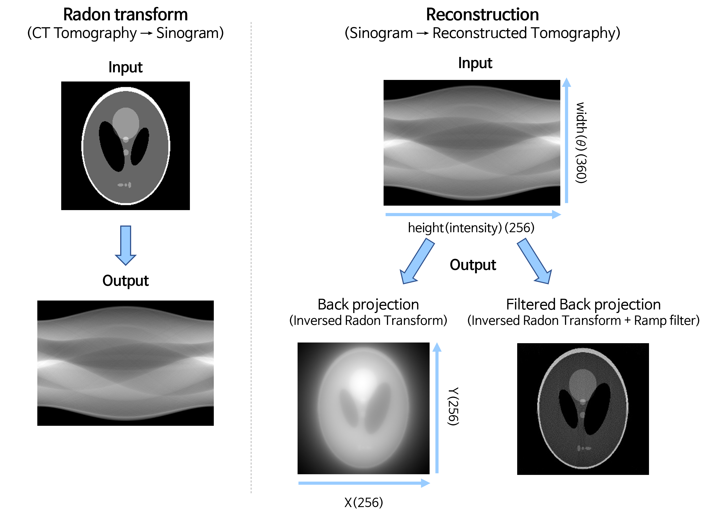
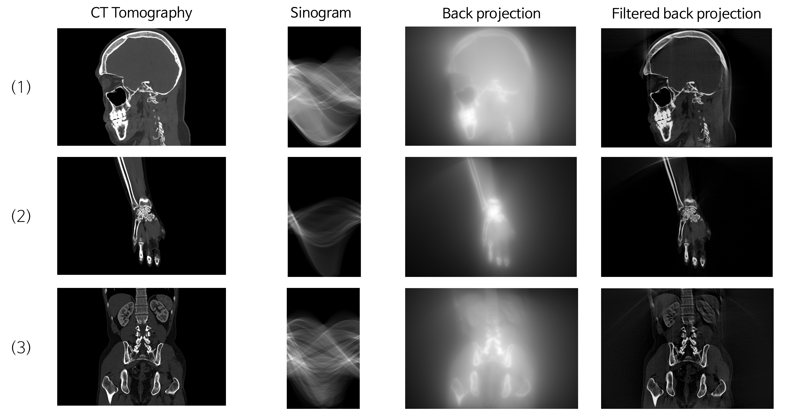

<div align="center">
    <h3>[Biomedical Imaging Project]</h3>
    <h1>🔬 CT Tomography Reconstruction 💀</h1> 
    <p>
        Gray scale CT Tomograpy로부터 Sinogram을 생성하고,
        <br>
        <strong>Back Projection</strong>과 <strong>Filtered Back Projection</strong>을 적용한 단층 촬영 영상을 재구성하는 과정을 구현한 C++ 과제물입니다.
    </p>
    <hr style="width: 80%;">
    <p align="justify">
    <li><strong>📅 2025-06-11 | </strong> 2023년에 작성한 초기 코드 백업본입니다. 다소 미흡한 부분이 있어 향후 리팩토링 예정입니다. 😅
    </li>
    </p>
</div>

<br>

## 📂 Project Structure

```bash
ct-fbp-reconstruction/
├── assets/
│   ├── doc/
│   └── img/         # 참고용 CT 이미지 자료
├── src/             # 💻 주요 소스코드
│   ├── bp.cpp       # Back projection (Inverse radon transform)
│   ├── fbp.cpp      # Filtered back projection (+ Ramp filter function)
│   └── radon.cpp    # Radon transform (Making a sinogram)
└── README.md
```

<br>

<div id="Apply">
    <h2>🎯 Reconstruction Result</h2>
    <h3>📍 Radon Transform & Back Projection 결과</h3>
    <div align="center">
        
    </div>
    <h3>📍 실제 CT Tomography 영상에 적용</h3>
    <div align="center">
        
    </div>
</div>
<br>
